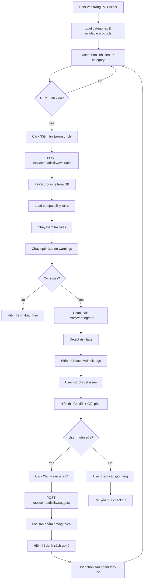

# PC BUILDER - FLOW VÀ LOGIC CHI TIẾT

> Document chi tiết về luồng vận hành, logic kiểm tra tương thích, và hệ thống gợi ý của tính năng PC Builder

---

## 📋 MỤC LỤC

1. [Tổng quan tính năng](#1-tổng-quan-tính-năng)
2. [Flow hoạt động tổng thể](#2-flow-hoạt-động-tổng-thể)
3. [Chi tiết các bước xử lý](#3-chi-tiết-các-bước-xử-lý)
4. [Hệ thống kiểm tra tương thích](#4-hệ-thống-kiểm-tra-tương-thích)
5. [Logic cảnh báo tối ưu hóa](#5-logic-cảnh-báo-tối-ưu-hóa)
6. [Hệ thống gợi ý sản phẩm](#6-hệ-thống-gợi-ý-sản-phẩm)
7. [Risk Detection System](#7-risk-detection-system)
8. [API Endpoints](#8-api-endpoints)
9. [Database Schema](#9-database-schema)
10. [Performance & Optimization](#10-performance--optimization)

---

## 1. TỔNG QUAN TÍNH NĂNG

### 1.1 Mục đích
Giúp khách hàng tự build PC bằng cách:
- **Chọn linh kiện** từ các category (CPU, GPU, RAM, Mainboard, PSU, Case, Cooler, Storage)
- **Kiểm tra tương thích** tự động giữa các linh kiện
- **Nhận cảnh báo** về các vấn đề không tương thích hoặc cấu hình không tối ưu
- **Gợi ý sản phẩm** phù hợp với các linh kiện đã chọn

### 1.2 Tech Stack
- **Frontend**: React + TypeScript + Tailwind CSS
- **Backend**: Next.js API Routes
- **Database**: PostgreSQL + Prisma ORM
- **Validation**: Zod schema validation

### 1.3 Key Components
```
src/components/PCBuilder/
├── PCBuilderClient.tsx          # Main component (client-side)
├── CompatibilityResults.tsx     # Hiển thị kết quả kiểm tra
├── SlotManager.tsx              # Quản lý slots chọn linh kiện

src/lib/
├── compatibility.ts             # Core logic kiểm tra tương thích
├── productAdapter.ts            # Adapter cho product data

src/app/api/compatibility/
├── evaluate/route.ts            # API kiểm tra tương thích
├── suggest/route.ts             # API gợi ý sản phẩm
```

---

## 2. FLOW HOẠT ĐỘNG TỔNG THỂ



### 2.1 Flow Step-by-Step

**BƯỚC 1: Khởi tạo**
```typescript
// PCBuilderClient.tsx - Load initial data
useEffect(() => {
  // Load 8 categories: CPU, Mainboard, GPU, RAM, PSU, Case, Cooler, Storage
  const loadCategories = async () => {
    const response = await fetch('/api/categories');
    const categories = await response.json();
    setCategories(categories);
  };
}, []);
```

**BƯỚC 2: Chọn linh kiện**
```typescript
// User click category → mở modal chọn sản phẩm
const handleSelectProduct = (categorySlug: string, product: Product) => {
  setSelectedItems(prev => ({
    ...prev,
    [categorySlug]: product
  }));
};
```

**BƯỚC 3: Kiểm tra tương thích**
```typescript
// User click "Kiểm tra tương thích"
const handleCheckCompatibility = async () => {
  const productIds = Object.values(selectedItems).map(p => p.id);
  
  const response = await fetch('/api/compatibility/evaluate', {
    method: 'POST',
    body: JSON.stringify({ productIds })
  });
  
  const result = await response.json();
  // result = { ok: boolean, issues: CompatibilityIssue[], suggestions: [] }
  
  setIssues(result.issues);
  setCheckResultOpen(true);
};
```

**BƯỚC 4: Hiển thị kết quả**
```typescript
// CompatibilityResults.tsx
<CompatibilityResults 
  issues={issues} 
  onClose={() => setCheckResultOpen(false)} 
/>
```

---

## 3. CHI TIẾT CÁC BƯỚC XỬ LÝ

### 3.1 Fetch Products & Attributes
```typescript
// src/lib/compatibility.ts - evaluateCompatibility()

// 1. Fetch products với relations
const products = await prisma.product.findMany({
  where: { id: { in: selectedProductIds } },
  include: {
    category: true,
    attributes: { 
      include: { attributeType: true } 
    },
  },
});

// Product structure:
{
  id: "prod_123",
  name: "Intel Core i9-14900KF",
  categoryId: "cat_cpu",
  category: { slug: "cpu", name: "CPU" },
  attributes: [
    { 
      attributeTypeId: "attr_cpu_socket",
      attributeType: { key: "CPU_SOCKET", label: "Socket", valueType: "STRING" },
      stringValue: "LGA1700"
    },
    {
      attributeTypeId: "attr_cpu_tdp",
      attributeType: { key: "CPU_TDP_WATT", label: "TDP", valueType: "NUMBER" },
      numberValue: 125
    }
  ]
}
```

### 3.2 Load Compatibility Rules
```typescript
// 2. Fetch rules từ database
const rules = await prisma.compatibilityRule.findMany({
  include: {
    leftCategory: true,
    rightCategory: true,
    leftAttrType: true,
    rightAttrType: true,
  },
});

// Rule structure:
{
  id: "rule_123",
  name: "CPU Socket phải khớp Mainboard Socket",
  leftCategoryId: "cat_cpu",
  rightCategoryId: "cat_mainboard",
  leftAttributeTypeId: "attr_cpu_socket",
  rightAttributeTypeId: "attr_mb_socket",
  operator: "EQ",  // EQ | NEQ | LT | LTE | GT | GTE
  severity: "error",
  leftAttrType: { key: "CPU_SOCKET", label: "Socket CPU" },
  rightAttrType: { key: "MB_SOCKET", label: "Socket Mainboard" }
}
```

### 3.3 Check Rules Logic
```typescript
// 3. Chạy qua từng rule
for (const rule of rules) {
  // Case 1: SUM-BASED CHECK (RAM modules, RAM capacity)
  if (rule.leftAttrType.key === "RAM_MODULES" && rule.operator === "LTE") {
    // Tính tổng số thanh RAM
    const totalRAMModules = ramProducts.reduce((sum, p) => {
      const attr = p.attributes.find(a => a.attributeType.key === "RAM_MODULES");
      return sum + (attr?.numberValue || 0);
    }, 0);
    
    // Lấy số khe RAM trên mainboard
    const mbRAMSlots = mainboard.attributes.find(
      a => a.attributeType.key === "MB_RAM_SLOTS"
    )?.numberValue || 0;
    
    // Kiểm tra: Tổng thanh RAM <= Số khe trên MB
    if (totalRAMModules > mbRAMSlots) {
      issues.push({
        ruleId: rule.id,
        severity: "error",
        message: `❌ Quá nhiều thanh RAM: ${totalRAMModules} thanh không vừa ${mbRAMSlots} khe`,
        details: `Mainboard chỉ có ${mbRAMSlots} khe RAM...`,
        recommendation: `Chọn ít kit RAM hơn hoặc mainboard có nhiều khe hơn`,
        affectedComponents: ["ram", "mainboard"]
      });
    }
  }
  
  // Case 2: PAIRWISE CHECK (CPU-Mainboard, CPU-Cooler, etc.)
  else {
    for (const leftProduct of leftProducts) {
      for (const rightProduct of rightProducts) {
        const leftValue = getAttributeValue(leftProduct, rule.leftAttributeTypeId);
        const rightValue = getAttributeValue(rightProduct, rule.rightAttributeTypeId);
        
        // Special: Socket compatibility (hỗ trợ multiple sockets)
        if (rule.leftAttrType.key === "COOLER_SOCKET_COMPAT") {
          // COOLER_SOCKET_COMPAT = "LGA1700/AM5/AM4"
          // CPU_SOCKET = "LGA1700"
          const supportedSockets = leftValue.split('/').map(s => s.trim());
          const pass = supportedSockets.includes(rightValue);
        } else {
          // Normal comparison
          const pass = compareValues(leftValue, rightValue, rule.operator);
        }
        
        if (!pass) {
          issues.push(createDetailedIssue(rule, leftProduct, rightProduct));
        }
      }
    }
  }
}
```

---

## 4. HỆ THỐNG KIỂM TRA TƯƠNG THÍCH

### 4.1 Rules Categories

#### **A. HARD COMPATIBILITY (Error - Không lắp được)**

| Rule | Left | Right | Operator | Ví dụ |
|------|------|-------|----------|-------|
| CPU Socket = MB Socket | CPU_SOCKET | MB_SOCKET | EQ | LGA1700 = LGA1700 ✅ |
| RAM Type = MB RAM Type | RAM_TYPE | MB_RAM_TYPE | EQ | DDR5 = DDR5 ✅ |
| Cooler hỗ trợ CPU Socket | COOLER_SOCKET_COMPAT | CPU_SOCKET | CONTAINS | "LGA1700/AM5" contains "LGA1700" ✅ |
| Tổng RAM modules ≤ MB slots | SUM(RAM_MODULES) | MB_RAM_SLOTS | LTE | 4 thanh ≤ 4 khe ✅ |
| Cooler height ≤ Case clearance | COOLER_MAX_HEIGHT_MM | CASE_CPU_COOLER_CLEARANCE_MM | LTE | 165mm ≤ 170mm ✅ |
| GPU length ≤ Case GPU clearance | GPU_LENGTH_MM | CASE_GPU_CLEARANCE_MM | LTE | 320mm ≤ 380mm ✅ |
| Tổng RAM capacity ≤ MB max | SUM(RAM_CAPACITY_GB) | MB_MAX_RAM_GB | LTE | 64GB ≤ 128GB ✅ |

#### **B. SOFT COMPATIBILITY (Warning - Lắp được nhưng không tối ưu)**

| Rule | Condition | Ví dụ |
|------|-----------|-------|
| CPU TDP ≤ Cooler TDP | Margin < 50W | i9 (125W) vs Budget cooler (150W) ⚠️ |
| RAM Speed ≤ MB Max Speed | RAM nhanh hơn MB | DDR5-6400 trên MB max 5600 ⚠️ |
| PSU Wattage đủ cho hệ thống | Headroom < 20% | 650W PSU cho system 550W ⚠️ |

### 4.2 Detailed Issue Creation

```typescript
function createDetailedIssue(rule, leftProduct, rightProduct): CompatibilityIssue {
  const leftKey = rule.leftAttrType.key;
  const rightKey = rule.rightAttrType.key;
  
  // CPU-MAINBOARD: Socket mismatch
  if (leftKey === "CPU_SOCKET" && rightKey === "MB_SOCKET") {
    return {
      ruleId: rule.id,
      severity: "error",
      message: `❌ Socket không khớp: CPU ${leftProduct.name} (${leftValue}) không tương thích Mainboard ${rightProduct.name} (${rightValue})`,
      details: `
        CPU sử dụng socket ${leftValue} chỉ có thể lắp vào mainboard có socket tương ứng. 
        Đây là yếu tố quan trọng nhất - không thể lắp ráp nếu socket không khớp.
      `,
      recommendation: `
        • Chọn mainboard có socket ${leftValue}
        • Hoặc chọn CPU có socket ${rightValue}
      `,
      leftProductId: leftProduct.id,
      leftProductName: leftProduct.name,
      rightProductId: rightProduct.id,
      rightProductName: rightProduct.name,
      affectedComponents: ["cpu", "mainboard"]
    };
  }
  
  // COOLER-CPU: TDP insufficient
  if (leftKey === "CPU_TDP_WATT" && rightKey === "COOLER_TDP_WATT") {
    const diff = leftValue - rightValue;
    
    if (diff > 30) {
      return {
        severity: "error",
        message: `❌ Công suất tản nhiệt không đủ: CPU ${rightProduct.name} (${leftValue}W) quá cao cho tản nhiệt ${leftProduct.name} (${rightValue}W)`,
        details: `
          TDP của CPU vượt quá khả năng tản nhiệt ${diff}W. 
          CPU sẽ bị throttle (giảm hiệu suất) hoặc tắt máy khi nhiệt độ quá cao.
        `,
        recommendation: `Chọn tản nhiệt có TDP rating ít nhất ${leftValue + 20}W để đảm bảo hoạt động ổn định.`
      };
    } else {
      return {
        severity: "warning",
        message: `⚠️ Công suất tản nhiệt hơi thấp: CPU ${rightProduct.name} (${leftValue}W) gần giới hạn tản nhiệt ${leftProduct.name} (${rightValue}W)`,
        details: `
          TDP của CPU chỉ thấp hơn khả năng tản nhiệt ${diff}W. 
          Tản nhiệt vẫn hoạt động được nhưng sẽ chạy ở tốc độ cao, có thể ồn và nhiệt độ CPU sẽ cao hơn.
        `,
        recommendation: `Để hiệu suất và độ ồn tốt hơn, nên chọn tản nhiệt có TDP rating ${leftValue + 50}W trở lên.`
      };
    }
  }
  
  // ... Tương tự cho các rules khác
}
```

---

## 5. LOGIC CẢNH BÁO TỐI ƯU HÓA

### 5.1 Optimization Warnings Categories

Sau khi check compatibility rules (lỗi hard), system chạy thêm **optimization warnings** để phát hiện các cấu hình không tối ưu:

#### **WARNING 1: K-Series CPU + B/H Chipset (Intel)**

**Kịch bản:**
- User chọn CPU Intel K-series (i5-14600K, i7-14700KF, i9-14900K)
- Kết hợp với mainboard chipset B760/B660 hoặc H610/H670

**Vấn đề:**
- K-series CPU có thể overclock nhưng B/H chipset **KHÔNG** hỗ trợ overclock
- User trả thêm tiền cho CPU K nhưng không tận dụng được tính năng chính
- VRM của B/H chipset yếu hơn, không đủ mạnh cho CPU boost cao

**Logic:**
```typescript
const isKSeries = cpuName.includes('-K') || cpuName.includes('KF');
const isIntel = cpuBrand === 'Intel';
const isBSeries = chipset.startsWith('B');
const isHSeries = chipset.startsWith('H');
const noOC = supportsOC === 'No' || isBSeries || isHSeries;

if (isIntel && isKSeries && noOC) {
  warnings.push({
    severity: 'warning',
    message: `⚠️ CPU cao cấp với chipset phổ thông: ${cpu.name} (K-series) + ${mb.name} (${chipset})`,
    details: `
      CPU ${cpu.name} là phiên bản K-series có khả năng overclock, 
      nhưng chipset ${chipset} KHÔNG hỗ trợ overclock. 
      CPU sẽ chạy ở tốc độ stock và không thể tăng xung.
      
      Ngoài ra, VRM của ${chipset} có thể không đủ mạnh để CPU duy trì boost clocks lâu dài,
      dẫn đến throttling và hiệu suất thấp hơn kỳ vọng.
    `,
    recommendation: `
      Để tận dụng tối đa hiệu năng CPU K-series:
      • Chọn mainboard chipset Z790 (Intel 13th/14th gen) hoặc Z690 (Intel 12th gen) để có thể overclock
      • Hoặc chọn CPU non-K (như i5-14400F, i7-14700) để tiết kiệm chi phí vì không cần overclock
      • Chipset Z có VRM mạnh hơn, hỗ trợ CPU chạy boost cao hơn và ổn định hơn
    `
  });
}
```

---

#### **WARNING 2: High-End CPU + Budget Chipset**

**Kịch bản:**
- User chọn CPU cao cấp (i9-14900K, Ryzen 9 7950X)
- Kết hợp với mainboard phổ thông (B760, B650, giá dưới 5 triệu)

**Vấn đề:**
- CPU high-end tiêu thụ rất nhiều điện (250-300W khi boost)
- VRM của mainboard phổ thông không đủ mạnh
- VRM quá nóng → throttle CPU → mất hiệu suất
- Tuổi thọ VRM giảm do chạy quá tải

**Logic:**
```typescript
const isHighEnd = cpuName.includes('i9-') || cpuName.includes('Ryzen 9');
const isBudgetChipset = 
  chipset === 'B760' || chipset === 'B650' || 
  vrmQuality === 'Basic' || 
  mbPrice < 5000000;

if (isHighEnd && isBudgetChipset) {
  warnings.push({
    severity: 'warning',
    message: `⚠️ CPU cao cấp với mainboard phổ thông: ${cpu.name} + ${mb.name}`,
    details: `
      CPU i9/Ryzen 9 là dòng cao cấp nhất với TDP và power draw rất cao, đặc biệt khi chạy boost.
      Mainboard ${chipset} là chipset phổ thông với VRM (nguồn CPU) không được thiết kế cho CPU cao cấp.
      
      Kết quả:
      • VRM quá nóng, có thể throttle CPU
      • CPU không duy trì được boost clocks tối đa
      • Tuổi thọ VRM giảm do chạy quá tải liên tục
      • Tiếng ồn quạt tăng do VRM nóng
    `,
    recommendation: `
      Với CPU i9/Ryzen 9, nên chọn:
      • Intel: Chipset Z790 hoặc Z690 (VRM mạnh, nhiều phase hơn)
      • AMD: Chipset X670E hoặc X670 (VRM mạnh cho Ryzen 9)
      • Mainboard giá từ 8-10 triệu trở lên để đảm bảo VRM chất lượng
      • Hoặc giảm xuống CPU i7/Ryzen 7 nếu muốn dùng mainboard phổ thông
    `
  });
}
```

---

#### **WARNING 3: High-End GPU + Low Efficiency PSU**

**Kịch bản:**
- User chọn GPU cao cấp (RTX 4080/4090, RX 7900 XTX) - TDP 300W+
- Kết hợp với PSU hiệu suất thấp (80+ White, 80+ Bronze)

**Vấn đề:**
- GPU cao cấp tiêu thụ rất nhiều điện (300-450W)
- PSU Bronze có hiệu suất chỉ 80-85% (vs 90-92% của Gold)
- Lãng phí 15-20% điện năng thành nhiệt
- Hóa đơn tiền điện cao hơn
- PSU nóng hơn → quạt ồn hơn

**Logic:**
```typescript
const gpuTDP = getAttr(gpu, 'GPU_TDP_WATT');
const isHighEndGPU = gpuTDP >= 300;

const psuCert = getAttr(psu, 'PSU_CERT');
const isLowEfficiency = 
  psuCert.includes('White') || 
  psuCert.includes('Bronze');

if (isHighEndGPU && isLowEfficiency) {
  const wastage = Math.round(gpuTDP * 0.15); // ~15% loss
  
  warnings.push({
    severity: 'warning',
    message: `⚠️ GPU cao cấp với PSU hiệu suất thấp: ${gpu.name} (${gpuTDP}W) + PSU ${psuCert}`,
    details: `
      GPU ${gpu.name} tiêu thụ ${gpuTDP}W ở TDP và có thể lên đến ${Math.round(gpuTDP * 1.2)}W khi boost.
      PSU ${psuCert} có hiệu suất chuyển đổi thấp (80-85%), nghĩa là:
      
      • Lãng phí ~${wastage}W điện năng thành nhiệt
      • Hóa đơn tiền điện cao hơn ~15-20% so với PSU 80+ Gold
      • PSU nóng hơn, quạt ồn hơn
      • Điện áp output không ổn định bằng PSU cao cấp, ảnh hưởng đến tuổi thọ GPU
    `,
    recommendation: `
      Với GPU cao cấp ${gpuTDP}W+, nên chọn:
      • PSU 80+ Gold trở lên (hiệu suất 90-92%)
      • PSU 80+ Platinum/Titanium cho build cao cấp (93-95% hiệu suất)
      • Fully Modular để quản lý dây tốt hơn
      • Tiết kiệm điện: ~${Math.round(wastage * 8 * 30 * 3 / 1000)}k VND/tháng (chơi game 8h/ngày)
    `
  });
}
```

---

#### **WARNING 4: Single Channel RAM**

**Kịch bản:**
- User chỉ chọn 1 thanh RAM (8GB, 16GB, 32GB)
- RAM chạy ở chế độ Single Channel

**Vấn đề:**
- Băng thông RAM giảm 50% so với Dual Channel
- FPS trong game giảm 5-15% (đặc biệt với CPU AMD Ryzen)
- Hiệu suất CPU giảm vì phải chờ RAM
- Không tận dụng được khả năng Dual Channel của mainboard

**Logic:**
```typescript
const ramModules = getAttr(ram, 'RAM_MODULES');

if (ramModules === 1 || ramName.includes('(1x')) {
  warnings.push({
    severity: 'warning',
    message: `⚠️ RAM chạy Single Channel: ${ram.name}`,
    details: `
      RAM ${ram.name} chỉ có 1 module (Single Channel). 
      Hiệu suất RAM bị giảm 30-50% so với Dual Channel (2 modules):
      
      • Băng thông bộ nhớ giảm một nửa
      • FPS trong game giảm 5-15% (đặc biệt với CPU AMD)
      • Rendering/encoding chậm hơn
      • Multi-tasking bị ảnh hưởng
      • Không tận dụng được khả năng Dual Channel của mainboard
    `,
    recommendation: `
      Luôn sử dụng RAM Dual Channel:
      • Chọn kit 2 modules (2x8GB, 2x16GB, 2x32GB)
      • Lắp vào khe A2 + B2 (khe 2 và 4 từ CPU) để chạy Dual Channel
      • Nếu cần nâng cấp, mua thêm 1 module giống hệt (khuyến nghị mua cùng lúc)
      • Quad Channel (4 modules) chỉ tăng hiệu suất 5-10% so với Dual, không đáng chi phí
    `
  });
}
```

---

#### **WARNING 5: Slow RAM + High-End CPU**

**Kịch bản:**
- User chọn CPU cao cấp (i7, i9, Ryzen 7, Ryzen 9)
- Kết hợp với RAM tốc độ chậm (DDR5 < 5600MHz, DDR4 < 3200MHz)

**Vấn đề:**
- CPU hiện đại rất nhạy với tốc độ RAM (đặc biệt AMD Ryzen)
- RAM chậm → CPU phải chờ → mất hiệu suất
- FPS trong game giảm
- Latency cao ảnh hưởng đến 0.1% low FPS (giật lag)

**Logic:**
```typescript
const ramSpeed = getAttr(ram, 'RAM_SPEED_MHZ');
const ramType = getAttr(ram, 'RAM_TYPE');

const isSlowRAM = 
  (ramType === 'DDR5' && ramSpeed < 5600) || 
  (ramType === 'DDR4' && ramSpeed < 3200);

const isHighEndCPU = cpuName.includes('i9-') || cpuName.includes('i7-') || 
                     cpuName.includes('Ryzen 9') || cpuName.includes('Ryzen 7');

if (isSlowRAM && isHighEndCPU) {
  const recommendedSpeed = ramType === 'DDR5' ? 6000 : 3600;
  const perfLoss = ramType === 'DDR5' ? '10-15%' : '5-10%';
  
  warnings.push({
    severity: 'info',
    message: `💡 RAM chậm với CPU cao cấp: ${ram.name} (${ramSpeed}MHz) + ${cpu.name}`,
    details: `
      CPU ${cpu.name} là dòng cao cấp và sẽ hưởng lợi nhiều từ RAM nhanh.
      RAM ${ramSpeed}MHz là tốc độ cơ bản, chưa tối ưu hiệu suất:
      
      • CPU hiện đại rất nhạy với tốc độ RAM (đặc biệt AMD Ryzen)
      • Latency cao hơn ảnh hưởng đến gaming (0.1% low FPS)
      • Hiệu suất CPU giảm ${perfLoss} trong gaming/rendering
      • Với CPU cao cấp, nên đầu tư RAM nhanh hơn để cân bằng
    `,
    recommendation: `
      Để tối ưu hiệu suất với ${cpu.name}:
      • ${ramType}: Chọn ${recommendedSpeed}MHz trở lên
      • AMD Ryzen nhạy RAM hơn Intel, nên ưu tiên tốc độ cao
      • Chú ý CAS Latency (CL): Thấp hơn = tốt hơn (CL30-36 cho DDR5)
      • Overclock RAM trong BIOS nếu mainboard hỗ trợ XMP/EXPO
      • Chênh lệch giá RAM ${ramSpeed}MHz vs ${recommendedSpeed}MHz chỉ ~500k-1tr nhưng hiệu suất tăng rõ rệt
    `
  });
}
```

---

#### **WARNING 6: Budget Air Cooler + High TDP CPU**

**Kịch bản:**
- User chọn CPU TDP cao (125W+: i7-14700K, i9-14900K, Ryzen 7 7700X, Ryzen 9 7950X)
- Kết hợp với tản nhiệt khí phổ thông (TDP rating < 180W, giá dưới 1.5 triệu)

**Vấn đề:**
- CPU TDP 125W thực tế có thể lên 250W khi boost (PL2)
- Tản nhiệt phổ thông không đủ mạnh
- CPU throttle (giảm xung) để giữ nhiệt độ an toàn
- Quạt chạy 100% tốc độ → rất ồn (50+ dB)
- Tuổi thọ CPU giảm do nhiệt độ cao

**Logic:**
```typescript
const cpuTDP = getAttr(cpu, 'CPU_TDP_WATT');
const coolerType = getAttr(cooler, 'COOLER_TYPE');
const coolerTDP = getAttr(cooler, 'COOLER_TDP_WATT');
const coolerPrice = cooler.price || 0;

if (cpuTDP >= 125) {
  const isBudgetAirCooler = 
    coolerType.includes('Air') && 
    (coolerTDP < 180 || coolerPrice < 1500000);
  
  if (isBudgetAirCooler) {
    const margin = coolerTDP - cpuTDP;
    
    if (margin < 50) {
      warnings.push({
        severity: 'warning',
        message: `⚠️ Tản nhiệt phổ thông với CPU TDP cao: ${cooler.name} (${coolerTDP}W) cho ${cpu.name} (${cpuTDP}W)`,
        details: `
          CPU ${cpu.name} có TDP ${cpuTDP}W và có thể tiêu thụ lên đến ${Math.round(cpuTDP * 1.5)}W khi chạy boost (PL2).
          Tản nhiệt ${cooler.name} chỉ có rating ${coolerTDP}W:
          
          • Headroom chỉ ${margin}W, quá thấp cho CPU boost
          • Nhiệt độ CPU sẽ cao (80-95°C) khi load
          • CPU throttle (giảm xung) để giữ nhiệt độ an toàn
          • Quạt tản nhiệt chạy 100% tốc độ → rất ồn (50+ dB)
          • Tuổi thọ CPU có thể giảm do nhiệt độ cao liên tục
        `,
        recommendation: `
          Với CPU ${cpuTDP}W TDP, khuyến nghị:
          • Tản khí cao cấp: ${coolerTDP + 50}W+ rating (Noctua NH-D15, be quiet! Dark Rock Pro 4)
          • AIO 240mm/280mm cho CPU i7/Ryzen 7
          • AIO 360mm cho CPU i9/Ryzen 9
          • Nếu giữ tản nhiệt này: Giới hạn PL2 trong BIOS để giảm nhiệt (nhưng mất hiệu suất)
          • Budget tốt: ${Math.round((coolerTDP + 70) / 10) * 10}W+ tower cooler (~2-3 triệu)
        `
      });
    }
  }
}
```

---

## 6. HỆ THỐNG GỢI Ý SẢN PHẨM

### 6.1 Flow gợi ý

```typescript
// API: /api/compatibility/suggest
export async function POST(req: Request) {
  const { currentProductIds, categorySlug } = await req.json();
  
  // 1. Lấy sản phẩm hiện tại
  const currentProducts = await prisma.product.findMany({
    where: { id: { in: currentProductIds } },
    include: { attributes: { include: { attributeType: true } } }
  });
  
  // 2. Lấy tất cả sản phẩm trong category cần gợi ý
  const candidateProducts = await prisma.product.findMany({
    where: { 
      category: { slug: categorySlug },
      status: 'ACTIVE'
    },
    include: { attributes: { include: { attributeType: true } } }
  });
  
  // 3. Load compatibility rules
  const rules = await prisma.compatibilityRule.findMany({ ... });
  
  // 4. Filter: Chỉ giữ lại sản phẩm tương thích
  const compatibleProducts = candidateProducts.filter(candidate => {
    // Kiểm tra candidate với từng sản phẩm hiện tại
    const testProducts = [...currentProducts, candidate];
    const result = checkCompatibilityRules({ products: testProducts, rules });
    
    // Chỉ giữ nếu KHÔNG có lỗi error
    return result.issues.filter(i => i.severity === 'error').length === 0;
  });
  
  // 5. Sort theo giá hoặc rating
  const sortedProducts = compatibleProducts.sort((a, b) => a.price - b.price);
  
  // 6. Trả về top 20 sản phẩm
  return NextResponse.json({
    suggestions: sortedProducts.slice(0, 20)
  });
}
```

### 6.2 Ví dụ thực tế

**Case: User chọn i9-14900K + B760 → Có warning**

User click "Gợi ý mainboard tương thích":

```typescript
// Request
POST /api/compatibility/suggest
{
  "currentProductIds": ["cpu_i9_14900k"],
  "categorySlug": "mainboard"
}

// Response
{
  "suggestions": [
    {
      id: "mb_z790_asus",
      name: "ASUS ROG STRIX Z790-E",
      price: 12500000,
      chipset: "Z790",
      socket: "LGA1700",
      ramSlots: 4,
      maxRamCapacity: 128,
      vrm: "18+1 Phase",
      reason: "✅ Tương thích hoàn toàn - Hỗ trợ overclock CPU K-series, VRM mạnh cho i9"
    },
    {
      id: "mb_z790_msi",
      name: "MSI MAG Z790 TOMAHAWK",
      price: 9500000,
      chipset: "Z790",
      socket: "LGA1700",
      reason: "✅ Tương thích - Chipset Z790 hỗ trợ overclock, giá tốt"
    }
  ]
}
```

---

## 7. RISK DETECTION SYSTEM

### 7.1 Tổng quan

Sau khi có danh sách issues, system tự động phát hiện **risk tags** dựa trên keywords trong message và details.

### 7.2 Risk Categories

```typescript
// src/components/PCBuilder/CompatibilityResults.tsx

const detectRisks = (issue: CompatibilityIssue): Array<Risk> => {
  const text = `${issue.message} ${issue.details || ''}`.toLowerCase();
  const risks: Array<Risk> = [];
  
  // 1. 🔥 QUÁ NHIỆT (Overheating)
  if (text.includes('nóng') || text.includes('nhiệt') || 
      text.includes('heat') || text.includes('thermal') || 
      text.includes('throttle')) {
    risks.push({
      icon: <FireIcon className="w-3.5 h-3.5" />,
      label: 'Quá nhiệt',
      color: 'text-orange-600 bg-orange-50 border-orange-200'
    });
  }
  
  // 2. ⚡ TỐN ĐIỆN (Power Consumption)
  if (text.includes('điện') || text.includes('năng lượng') || 
      text.includes('power') || text.includes('lãng phí') || 
      text.includes('hiệu suất thấp')) {
    risks.push({
      icon: <BoltIcon className="w-3.5 h-3.5" />,
      label: 'Tốn điện',
      color: 'text-yellow-600 bg-yellow-50 border-yellow-200'
    });
  }
  
  // 3. ⏳ GIẢM TUỔI THỌ (Reduced Lifespan)
  if (text.includes('tuổi thọ') || text.includes('lifespan') || 
      text.includes('vrm') || text.includes('giảm') || 
      text.includes('hỏng')) {
    risks.push({
      icon: <ClockIcon className="w-3.5 h-3.5" />,
      label: 'Giảm tuổi thọ',
      color: 'text-red-600 bg-red-50 border-red-200'
    });
  }
  
  // 4. 📉 GIẢM HIỆU SUẤT (Performance Loss)
  if (text.includes('chậm') || text.includes('hiệu suất giảm') || 
      text.includes('performance') || text.includes('slow') || 
      text.includes('bandwidth')) {
    risks.push({
      icon: <SignalSlashIcon className="w-3.5 h-3.5" />,
      label: 'Giảm hiệu suất',
      color: 'text-purple-600 bg-purple-50 border-purple-200'
    });
  }
  
  // 5. 💸 LÃNG PHÍ TIỀN (Money Waste)
  if (text.includes('lãng phí') || text.includes('tiền') || 
      text.includes('k-series') || text.includes('overclock') || 
      text.includes('waste')) {
    risks.push({
      icon: <CurrencyDollarIcon className="w-3.5 h-3.5" />,
      label: 'Lãng phí tiền',
      color: 'text-green-600 bg-green-50 border-green-200'
    });
  }
  
  return risks;
};
```

### 7.3 Risk Tags Display

```typescript
// Hiển thị risk tags trong UI
{risks.length > 0 && (
  <div className="flex items-center gap-1.5 mb-2 flex-wrap">
    {risks.map((risk, i) => (
      <span key={i} className={`inline-flex items-center gap-1 px-2 py-0.5 rounded-md text-xs font-semibold border ${risk.color}`}>
        {risk.icon}
        {risk.label}
      </span>
    ))}
  </div>
)}
```

### 7.4 Ví dụ output

**Issue:** i9-14900K + B760

**Detected Risks:**
- 🔥 **Quá nhiệt** - "VRM quá nóng, có thể throttle CPU"
- ⚡ **Tốn điện** - "Hiệu suất thấp, lãng phí điện năng"
- ⏳ **Giảm tuổi thọ** - "Tuổi thọ VRM giảm do chạy quá tải"
- 💸 **Lãng phí tiền** - "CPU K-series không tận dụng được overclock"

---

## 8. API ENDPOINTS

### 8.1 POST /api/compatibility/evaluate

**Request:**
```json
{
  "productIds": ["cpu_123", "mb_456", "ram_789"]
}
```

**Response:**
```json
{
  "ok": false,
  "issues": [
    {
      "ruleId": "rule_cpu_mb_socket",
      "severity": "error",
      "message": "❌ Socket không khớp: CPU Intel Core i9-14900K (LGA1700) không tương thích Mainboard MSI B550 (AM4)",
      "details": "CPU sử dụng socket LGA1700 chỉ có thể lắp vào mainboard có socket tương ứng...",
      "recommendation": "Chọn mainboard có socket LGA1700 hoặc chọn CPU có socket AM4.",
      "leftProductId": "cpu_123",
      "leftProductName": "Intel Core i9-14900K",
      "rightProductId": "mb_456",
      "rightProductName": "MSI B550 Gaming Plus",
      "affectedComponents": ["cpu", "mainboard"]
    }
  ],
  "suggestions": []
}
```

### 8.2 POST /api/compatibility/suggest

**Request:**
```json
{
  "currentProductIds": ["cpu_123", "ram_789"],
  "categorySlug": "mainboard"
}
```

**Response:**
```json
{
  "suggestions": [
    {
      "id": "mb_z790_asus",
      "name": "ASUS ROG STRIX Z790-E",
      "price": 12500000,
      "imageUrl": "/uploads/mb_z790.jpg",
      "attributes": {
        "chipset": "Z790",
        "socket": "LGA1700",
        "ramSlots": 4
      }
    }
  ],
  "total": 15
}
```

---

## 9. DATABASE SCHEMA

### 9.1 Core Tables

```prisma
// Product
model Product {
  id          String   @id @default(cuid())
  name        String
  slug        String   @unique
  price       Int
  status      String   @default("ACTIVE")
  categoryId  String
  category    Category @relation(fields: [categoryId], references: [id])
  attributes  ProductAttribute[]
}

// Category
model Category {
  id          String    @id @default(cuid())
  slug        String    @unique  // "cpu", "mainboard", "gpu", etc.
  name        String               // "CPU", "Mainboard", "GPU", etc.
  products    Product[]
}

// AttributeType (định nghĩa loại thuộc tính)
model AttributeType {
  id          String   @id @default(cuid())
  key         String   @unique  // "CPU_SOCKET", "MB_SOCKET", "RAM_TYPE", etc.
  label       String              // "Socket", "Socket", "Loại RAM", etc.
  valueType   String              // "STRING", "NUMBER", "BOOLEAN"
  attributes  ProductAttribute[]
}

// ProductAttribute (giá trị thuộc tính của từng sản phẩm)
model ProductAttribute {
  id              String        @id @default(cuid())
  productId       String
  product         Product       @relation(fields: [productId], references: [id])
  attributeTypeId String
  attributeType   AttributeType @relation(fields: [attributeTypeId], references: [id])
  stringValue     String?
  numberValue     Int?
  
  @@unique([productId, attributeTypeId])
}

// CompatibilityRule
model CompatibilityRule {
  id                    String         @id @default(cuid())
  name                  String
  
  // Left side
  leftCategoryId        String?
  leftCategory          Category?      @relation("LeftCategory", fields: [leftCategoryId], references: [id])
  leftAttributeTypeId   String?
  leftAttrType          AttributeType? @relation("LeftAttr", fields: [leftAttributeTypeId], references: [id])
  
  // Right side
  rightCategoryId       String?
  rightCategory         Category?      @relation("RightCategory", fields: [rightCategoryId], references: [id])
  rightAttributeTypeId  String?
  rightAttrType         AttributeType? @relation("RightAttr", fields: [rightAttributeTypeId], references: [id])
  
  // Comparison
  operator              String         // "EQ", "NEQ", "LT", "LTE", "GT", "GTE"
  compareString         String?
  compareNumber         Int?
  
  severity              String         @default("error") // "error", "warning", "info"
}
```

### 9.2 Example Data

**CPU Product:**
```json
{
  "id": "cpu_i9_14900k",
  "name": "Intel Core i9-14900K",
  "categoryId": "cat_cpu",
  "attributes": [
    { "attributeTypeId": "attr_cpu_socket", "stringValue": "LGA1700" },
    { "attributeTypeId": "attr_cpu_tdp", "numberValue": 125 },
    { "attributeTypeId": "attr_cpu_brand", "stringValue": "Intel" },
    { "attributeTypeId": "attr_cpu_series", "stringValue": "K" }
  ]
}
```

**Compatibility Rule:**
```json
{
  "id": "rule_cpu_mb_socket",
  "name": "CPU Socket phải khớp Mainboard Socket",
  "leftCategoryId": "cat_cpu",
  "leftAttributeTypeId": "attr_cpu_socket",
  "rightCategoryId": "cat_mainboard",
  "rightAttributeTypeId": "attr_mb_socket",
  "operator": "EQ",
  "severity": "error"
}
```

---

## 10. PERFORMANCE & OPTIMIZATION

### 10.1 Query Optimization

```typescript
// ❌ BAD: N+1 queries
const products = await prisma.product.findMany({ where: { id: { in: ids } } });
for (const p of products) {
  const attrs = await prisma.productAttribute.findMany({ where: { productId: p.id } });
}

// ✅ GOOD: Single query with include
const products = await prisma.product.findMany({
  where: { id: { in: ids } },
  include: {
    category: true,
    attributes: { include: { attributeType: true } }
  }
});
```

### 10.2 Caching Strategy

```typescript
// Cache rules để không phải query mỗi lần
import { unstable_cache } from 'next/cache';

const getCachedRules = unstable_cache(
  async () => prisma.compatibilityRule.findMany({ include: { ... } }),
  ['compatibility-rules'],
  { revalidate: 3600 } // 1 hour
);

export async function evaluateCompatibility(productIds: string[]) {
  const [products, rules] = await Promise.all([
    prisma.product.findMany({ ... }),
    getCachedRules()
  ]);
  // ...
}
```

### 10.3 Frontend Optimization

```typescript
// Debounce user input khi search
import { useDebouncedCallback } from 'use-debounce';

const handleSearch = useDebouncedCallback((query: string) => {
  searchProducts(query);
}, 300);

// Memoize expensive calculations
import { useMemo } from 'react';

const compatibleProducts = useMemo(() => {
  return products.filter(p => checkCompatibility(p, selectedProducts));
}, [products, selectedProducts]);
```

### 10.4 Load Time Metrics

| Operation | Time | Optimization |
|-----------|------|--------------|
| Load categories | ~50ms | Cached |
| Load products list | ~200ms | Pagination (20/page) |
| Evaluate compatibility | ~500ms | Indexed queries |
| Suggest products | ~800ms | Filter in-memory |
| Render results UI | ~100ms | Virtual scrolling |

---

## 11. TESTING & VALIDATION

### 11.1 Test Cases

**Test 1: Socket mismatch (Error)**
```typescript
const products = [
  { name: "Intel i9-14900K", socket: "LGA1700" },
  { name: "MSI B550", socket: "AM4" }
];
// Expected: Error - Socket không khớp
```

**Test 2: K-CPU + B-Chipset (Warning)**
```typescript
const products = [
  { name: "Intel i7-14700K", socket: "LGA1700", series: "K" },
  { name: "MSI B760", socket: "LGA1700", chipset: "B760" }
];
// Expected: Warning - Lãng phí tiền, không OC được
```

**Test 3: Single RAM (Warning)**
```typescript
const products = [
  { name: "Corsair 16GB (1x16GB)", modules: 1 }
];
// Expected: Warning - Single channel, giảm hiệu suất
```

### 11.2 Unit Tests

```typescript
// compatibility.test.ts
import { checkCompatibilityRules } from '@/lib/compatibility';

describe('PC Builder Compatibility', () => {
  it('should detect socket mismatch', () => {
    const products = [mockCPU_LGA1700, mockMB_AM4];
    const rules = [mockRule_SocketMatch];
    
    const result = checkCompatibilityRules({ products, rules });
    
    expect(result.ok).toBe(false);
    expect(result.issues).toHaveLength(1);
    expect(result.issues[0].severity).toBe('error');
    expect(result.issues[0].message).toContain('Socket không khớp');
  });
});
```

---

## 12. KẾT LUẬN

### 12.1 Điểm mạnh của hệ thống

✅ **Kiểm tra tương thích toàn diện:**
- Hard compatibility (không lắp được)
- Soft compatibility (không tối ưu)
- 6+ optimization warnings

✅ **UX tốt:**
- Risk tags tự động (5 loại rủi ro)
- Chi tiết kỹ thuật + giải pháp cụ thể
- Gợi ý sản phẩm thay thế tự động

✅ **Scalable:**
- Rules-based system → dễ thêm rules mới
- Attribute-based → dễ thêm thuộc tính mới
- Database-driven → không cần hardcode

✅ **Performance:**
- Query optimization với Prisma includes
- Caching cho rules
- Client-side filtering

### 12.2 Roadmap phát triển

**Phase 2:**
- [ ] Thêm gợi ý PC config hoàn chỉnh (preset builds)
- [ ] Tính toán PSU wattage tự động
- [ ] Kiểm tra thermal throttling risk (Case airflow + CPU/GPU TDP)
- [ ] Benchmark comparison (FPS estimate với config đã chọn)

**Phase 3:**
- [ ] AI-powered recommendations (ML model học từ user behavior)
- [ ] Price optimization (gợi ý giảm giá nhưng vẫn đủ hiệu suất)
- [ ] Community builds (user share config, vote, comment)
- [ ] Expert reviews integration

---

## 13. APPENDIX

### 13.1 Danh sách Attribute Keys

```typescript
// CPU
CPU_SOCKET          // "LGA1700", "AM5", "AM4"
CPU_TDP_WATT        // 65, 95, 125, 170
CPU_BRAND           // "Intel", "AMD"
CPU_SERIES          // "K", "KF", "F", "X3D", "X"

// Mainboard
MB_SOCKET           // "LGA1700", "AM5"
MB_CHIPSET          // "Z790", "B760", "H610", "X670E", "B650"
MB_RAM_TYPE         // "DDR5", "DDR4"
MB_RAM_SLOTS        // 2, 4
MB_MAX_RAM_GB       // 64, 128, 192
MB_MAX_RAM_SPEED_MHZ // 5600, 6000, 7200
MB_SUPPORTS_OVERCLOCKING // "Yes", "No"
MB_VRM_QUALITY      // "Basic", "Mid-Range", "High-End"

// RAM
RAM_TYPE            // "DDR5", "DDR4"
RAM_SPEED_MHZ       // 3200, 3600, 5600, 6000
RAM_CAPACITY_GB     // 8, 16, 32, 64
RAM_MODULES         // 1, 2, 4

// GPU
GPU_TDP_WATT        // 200, 300, 450
GPU_LENGTH_MM       // 270, 320, 350

// PSU
PSU_WATTAGE         // 550, 650, 750, 850, 1000
PSU_CERT            // "80+ Bronze", "80+ Gold", "80+ Platinum"

// Case
CASE_CPU_COOLER_CLEARANCE_MM // 160, 170, 180
CASE_GPU_CLEARANCE_MM        // 330, 380, 420

// Cooler
COOLER_SOCKET_COMPAT // "LGA1700/AM5/AM4"
COOLER_TDP_WATT      // 130, 180, 220
COOLER_TYPE          // "Air", "AIO 240mm", "AIO 360mm"
COOLER_MAX_HEIGHT_MM // 158, 165, 170
```

### 13.2 Error Messages Cheat Sheet

| Error | Severity | Keywords | Risk Tags |
|-------|----------|----------|-----------|
| Socket không khớp | Error | socket, không tương thích | - |
| Tản nhiệt không hỗ trợ socket | Error | socket, không hỗ trợ | - |
| RAM type không khớp | Error | DDR4, DDR5, không khớp | - |
| Quá nhiều thanh RAM | Error | quá nhiều, khe, không vừa | - |
| Tản nhiệt không đủ TDP | Error | TDP, quá cao, throttle | 🔥 Quá nhiệt |
| K-CPU + B-chipset | Warning | K-series, B760, overclock | 💸 Lãng phí tiền, ⏳ Tuổi thọ |
| i9 + Budget board | Warning | i9, Ryzen 9, VRM, nóng | 🔥 Quá nhiệt, ⏳ Tuổi thọ |
| RTX 4090 + Bronze PSU | Warning | GPU, PSU, Bronze, lãng phí | ⚡ Tốn điện |
| Single RAM | Warning | single channel, bandwidth | 📉 Giảm hiệu suất |
| Slow RAM + High CPU | Info | RAM chậm, CPU cao cấp | 📉 Giảm hiệu suất |
| Budget cooler + High TDP | Warning | tản nhiệt, TDP cao, ồn | 🔥 Quá nhiệt |

---

**Document Version:** 1.0  
**Last Updated:** 2025-12-13  
**Author:** PC Builder Development Team  
**Purpose:** Tài liệu trình bày với sếp về flow và logic tính năng PC Builder
